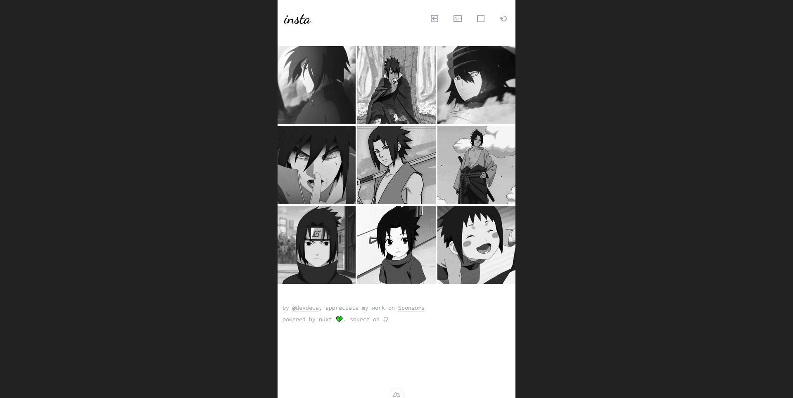

# Insta 📷

Insta es una aplicación web diseñada específicamente para brindarte un `vistazo antes de subir tus fotos` a Instagram.

Será muy útil para aquellos que siempre desean ser precisos con cada cuadrícula, ideal para fotógrafos que disfrutan compartiendo su trabajo en Instagram.

Planificador de publicaciones de fotos gratuito.

**[¡Prueba la aplicación ahora!](https://insta-adydetra.vercel.app)**

## Lista de verificación

- [x] Importación por lotes
- [x] Modo oscuro
- [x] PWA

## Vista previa

`Insta`

`Instagram`

## Licencia

El código está licenciado bajo [MIT](LICENSE)
