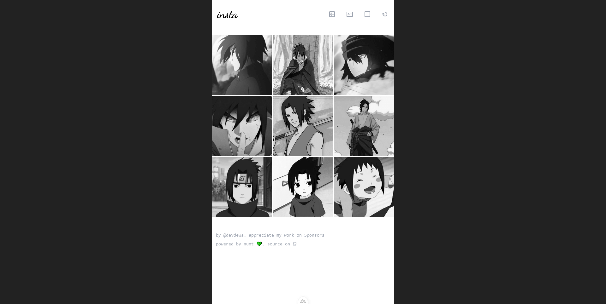

# Insta 📷

Insta is a web application specifically designed to give you an overview before upload your photos to Instagram. Insta will be very useful for those of you who always want to be precise with each grid, suitable for photographers who like sharing their work on Instagram.

Free photo post planner.

**[Try the App now!](https://insta-planner.vercel.app)**

## Checklist

- [x] Batch importing
- [ ] Dark mode
- [ ] PWA

## Preview

### Insta

### Instagram

## License

The code is licensed [MIT](LICENSE)
